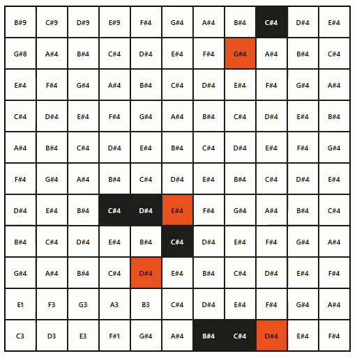

# Conway's Game of Life as a musical instrument

A musical take on Conway's Game of Life. Each newborn cell triggers the sound of its corresponding note.
The original idea was found [here](https://youtu.be/b2SjVwYNr54?si=-Mkxz6Vw33AXS1Kc), feel free to fork and edit soundboard for more interesting results.

## Rules

- Any live cell with fewer than two live neighbours dies, as if by underpopulation.
- Any live cell with two or three live neighbours lives on to the next generation.
- Any live cell with more than three live neighbours dies, as if by overpopulation.
- Any dead cell with exactly three live neighbours becomes a live cell, as if by reproduction. 

## Sound

Newborn cell are playing sound of the coresponding note on grid.
